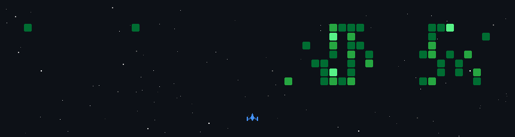

  <picture>
    <source media="(prefers-color-scheme: light)" srcset="https://www.gitskins.com/api/section/hero?username=githarshil&theme=aurora&mode=light" />
    
  </picture>

  

## Building at the intersection of full-stack and AI

I'm a Computer Science Engineering student at JSS Academy of Technical Education, Bengaluru, with a solid foundation in the MERN stack (React, Node.js, Express, MongoDB) and Supabase.
I'm also broadening into Java and system design alongside the web-dev tooling side of things.

  <picture>
    <source media="(prefers-color-scheme: light)" srcset="https://www.gitskins.com/api/section/about?username=githarshil&theme=aurora&mode=light" />
    
  </picture>

## Selected work

  

  <a href="https://github.com/githarshil?tab=repositories"><b>Explore all repositories</b></a>

## Engineering signal

  

  

## A profile that moves

The contribution graph is part of the profile experience. It refreshes automatically from this repository and turns public activity into a small visual system.

  

## Current focus

  

  <a href="https://github.com/githarshil?tab=repositories">See all repositories</a>
  &nbsp;·&nbsp;

